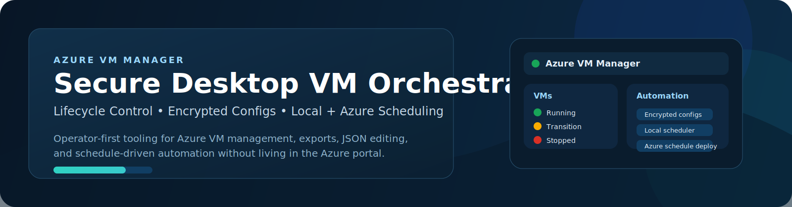
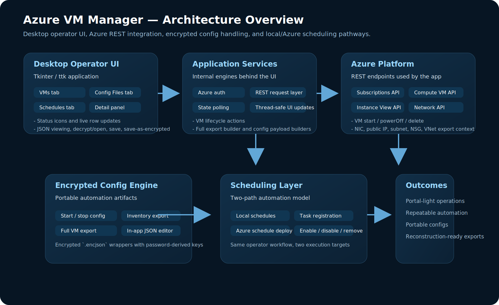
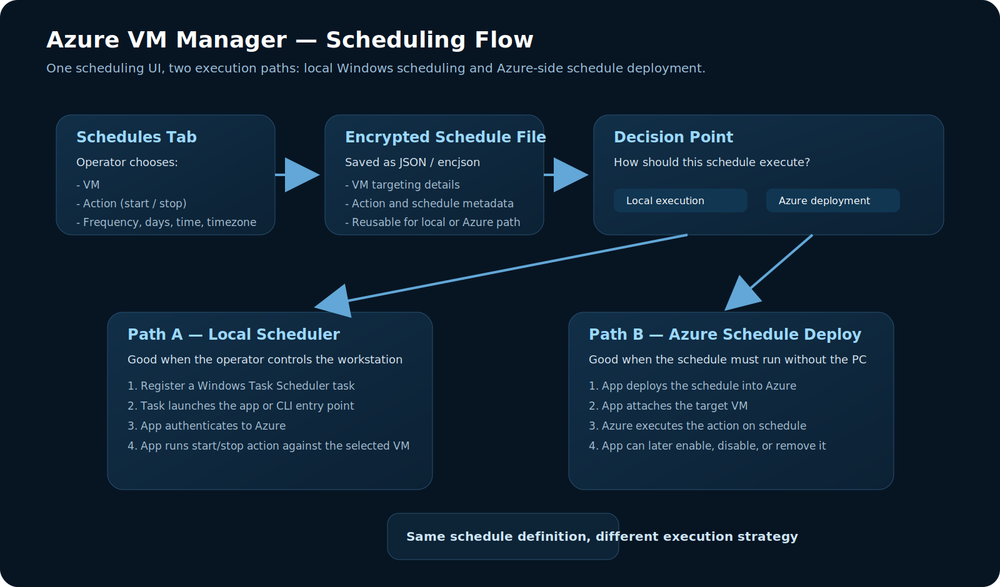
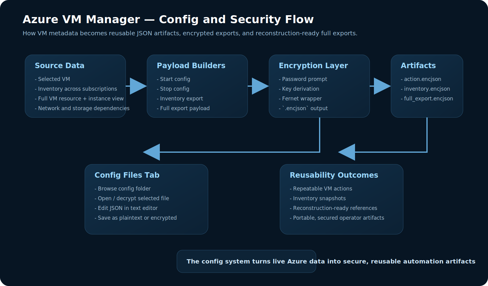

<div align="center">



# Azure VM Manager

**Secure desktop orchestration for Azure virtual machines**  
Start, stop, delete, export, encrypt, schedule, and manage Azure VMs from a single operator-first interface.

<p>
  
  
  
  
  
</p>

</div>

---

## Why this project exists

Azure VM Manager turns a basic script into a full desktop operations tool. The app enumerates Azure subscriptions and VMs, displays power state with status icons, shows detailed VM metadata, exports encrypted JSON configurations, edits config files inside the app, and supports both local and Azure-driven scheduling workflows. Those capabilities are present in the uploaded project code, including VM lifecycle actions, encrypted config handling, full VM export logic, and the tabbed operator UI. fileciteturn7file1turn7file4turn7file6

This repo is aimed at engineers who want **portal-free VM operations**, **repeatable automation**, and **secure config portability**.

## Highlights

- **VM lifecycle control**  
  Start, stop, and delete Azure VMs from a desktop UI with live status updates and polling. fileciteturn7file4
- **Operator-friendly interface**  
  Separate tabs for VM operations and config management, plus a detailed side panel instead of one long raw VM line. fileciteturn7file4turn7file5
- **Encrypted config system**  
  Save VM action files, inventory exports, and full VM exports as encrypted `.encjson` payloads. fileciteturn7file3turn7file6
- **Built-in JSON editing**  
  Open, decrypt, edit, validate, and re-save config files from the UI. fileciteturn7file1turn7file5
- **Scheduling architecture**  
  Local scheduler support was added in-app first, then extended toward Azure-side schedule deployment so the operator can drive both modes from the same project workflow. This direction reflects the current project evolution in the conversation and codebase. fileciteturn7file1

## Screens at a glance

<div align="center">
  
  
  
</div>

## Architecture set

### 1) System overview
Shows the desktop UI, Azure auth path, compute/network calls, encrypted config engine, and scheduler layer.


### 2) Scheduling flow
Shows how a saved schedule can execute through local Windows Task Scheduler or be deployed into Azure scheduling automation.


### 3) Config and security flow
Shows JSON editing, encryption/decryption, export paths, and full VM export dependencies.


## Feature map

| Area | What it does |
|---|---|
| VM Operations | Load VMs across subscriptions, inspect details, start, stop, delete |
| Status UX | Visual status icons, detail pane, live polling during transitions |
| Exports | Start config, stop config, VM inventory, full VM export |
| Encryption | Password-derived encryption for saved config artifacts |
| Config Workspace | Browse, open, decrypt, edit, validate, save, save-as-encrypted |
| Scheduling | Local schedule files and app-driven scheduling direction for Azure |

## Project structure

```text
.
├── autostart_ui_phase2_schedule.py
├── vm_configs/
└── assets/
    ├── hero-header.svg
    ├── architecture-overview.svg
    ├── scheduling-flow.svg
    └── config-security-flow.svg
```

## Core workflows

### VM operations
1. Authenticate with Azure using `DefaultAzureCredential`
2. Enumerate subscriptions
3. Enumerate VMs and instance view
4. Render status + metadata in UI
5. Execute start / stop / delete actions
6. Poll until the state changes

This flow reflects the current code structure using Azure REST calls, instance-view status parsing, and row-level UI refresh. fileciteturn7file4

### Config workflow
1. Select a VM or inventory scope
2. Build a JSON payload
3. Encrypt and save as `.encjson`
4. Reopen and decrypt later
5. Edit the JSON in-app
6. Re-save as plaintext `.json` or encrypted `.encjson`

That workflow is directly represented in the config payload builders, encrypted save helpers, and config editor paths in the uploaded code. fileciteturn7file3turn7file1

### Full export workflow
The full export process fetches the VM resource, instance view, NICs, IP configurations, public IPs, subnet/VNet context, NSGs, and storage-related details to make the saved artifact useful for reconstruction and documentation. fileciteturn7file6

## Quick start

```bash
pip install requests azure-identity cryptography
python autostart_ui_phase2_schedule.py
```

You will typically authenticate with Azure through one of the credential paths supported by `DefaultAzureCredential`, such as Azure CLI sign-in, environment variables, or managed identity. That credential model is explicitly used in the code. fileciteturn7file4

## Why this reads well in a portfolio

This project demonstrates more than CRUD against Azure:
- desktop operator UX
- asynchronous UI-safe threading
- REST integration against Azure services
- encrypted artifact design
- reusable automation payloads
- multi-path scheduling strategy
- practical export/reconstruction thinking

## Roadmap

- Import a full export and prefill VM creation
- Add schedule-state dashboarding
- Add filtering and search for larger VM estates
- Add stronger config schema validation
- Add screenshot examples to the README
- Package the app as a standalone Windows executable

## Author positioning

This project is strongest when presented as an **operations and automation platform** rather than a simple VM utility. It showcases secure engineering, operator workflow design, and architecture-level thinking around Azure infrastructure automation.

